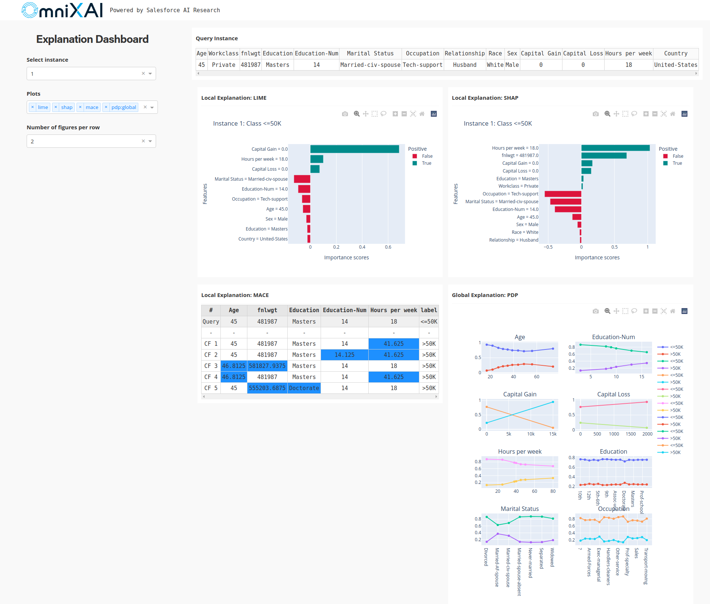
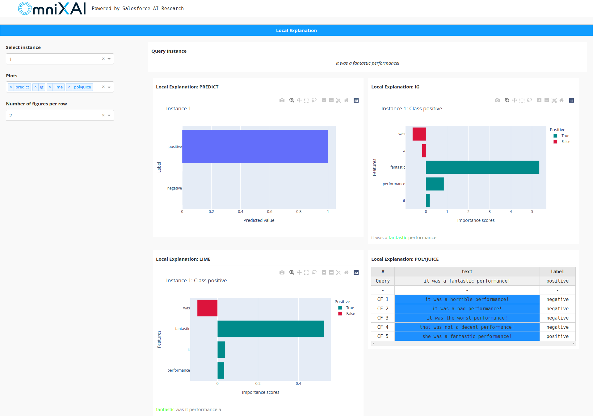

OmniXAI: An Explanation Toolbox
===============================

Introduction
------------

OmniXAI (short for Omni eXplainable AI) is a Python library for explainable AI (XAI), offering omni-way explainable AI and interpretable
machine learning capabilities to address many pain points in explaining decisions made by machine learning
models in practice. OmniXAI aims to be a one-stop comprehensive library that makes explainable AI easy for
data scientists, ML researchers and practitioners who need explanation for various types of data, models and
explanation methods at different stages of ML process:

.. image:: _static/ml_pipeline.png

OmniXAI includes a rich family of explanation methods integrated in a unified interface, which
supports multiple data types (tabular data, images, texts, time-series), multiple types of ML models
(traditional ML in Scikit-learn and deep learning models in PyTorch/TensorFlow), and a range of diverse explaination
methods including "model-specific" and "model-agnostic" methods (such as feature-attribution explanation,
counterfactual explanation, gradient-based explanation, etc). For practitioners, OmniXAI provides an easy-to-use
unified interface to generate the explanations for their applications by only writing a few lines of
codes, and also a GUI dashboard for visualization for obtaining more insights about decisions.

Library Design
--------------

OmniXAI has five key subpackages:

- :py:mod:`omnixai.data`: This package contains the classes for representing tabular, image, text, and time series data,
  i.e., :py:mod:`omnixai.data.tabular`, :py:mod:`omnixai.data.image`, :py:mod:`omnixai.data.text` and :py:mod:`omnixai.data.timeseries`,
  respectively. For example, the explainers for tabular data use an instance of :py:mod:`omnixai.data.tabular` as one of their inputs.
  The library provides simple constructors for creating instances of these classes from numpy arrays, pandas dataframes,
  pillow images or strings.
- :py:mod:`omnixai.preprocessing`: This package contains various pre-processing functions for different feature types:

  - One-hot encoding and ordinal encoding for categorical features.
  - KBins, standard normalization, min-max normalization, rescaling, NaN-filling for continuous-valued features.
  - A pre-processing module :py:mod:`omnixai.preprocessing.tabular` for tabular data.
  - Recaling, normalization, resizing for image data.
  - The TF-IDF transformation and token-to-id transformation for text data.
  - A pre-processing pipeline :py:mod:`omnixai.preprocessing.pipeline` combining multiple pre-processing functions together.

  For tabular data, :py:mod:`omnixai.preprocessing.tabular.TabularTransform` provides a convenient way for feature pre-processing.
  One can simply use this class to transform the raw data into the training/test dataset that a particular machine learning
  model can consume.

- :py:mod:`omnixai.explainers`: This is the main package in the library, which contains all the supported explainers.
  The explainers are categorized into the following groups:

  - :py:mod:`omnixai.explainers.data`: It is for data exploration/analysis, including feature correlation analysis,
    feature imbalance analysis, feature selection, etc.
  - :py:mod:`omnixai.explainers.prediction`: It computes the performance metrics for classification and regression tasks.
  - :py:mod:`omnixai.explainers.tabular`: It contains the explainers for tabular data, e.g., global explanations
    such as PDP, local explanations such as LIME, SHAP, MACE.
  - :py:mod:`omnixai.explainers.vision`: It contains the explainers for vision tasks, e.g., integrated-gradient,
    Grad-CAM, contrastive explanation, counterfactual explanation.
  - :py:mod:`omnixai.explainers.nlp`: It contains the explainers for NLP tasks, e.g., LIME, integrated-gradient.
  - :py:mod:`omnixai.explainers.timeseries`: It contains the explainers for time series tasks, e.g., SHAP, MACE.
  - :py:mod:`omnixai.explainers.vision_language`: It contains the explainers for vision-language tasks, e.g., IG, GradCAM.
  - :py:mod:`omnixai.explainers.ranking`: It contains the explainers for ranking tasks, e.g., ValidityRankingExplainer,
    PermutationRankingExplainer, MACE.

For "tabular", "vision", "nlp" and "timeseries", the explainers are further categorized into "model-agnostic", "model-specific" and "counterfactual".
A "model-agnostic" explainer can handle black-box ML models, i.e., only requiring a prediction function without
knowing model details. A "model-specific" explainer requires some information of ML models, e.g., whether the model is
differentiable, whether the model is a linear model or a tree-based model. "counterfactual" is a special group for counterfactual
explanation methods which may be either "model-agnostic" or "model-specific".

- :py:mod:`omnixai.explanations`: This package contains the classes for explanation results. For example,
  :py:mod:`omnixai.explanations.tabular.feature_importance` is used for storing feature-importance/attribution explanations.
  All of these classes provide plotting functions for visualization, e.g., "plot" using "Matplotlib", "plotly_plot" using "Dash"
  and "ipython_plot" for IPython. Explanations are categorized into these groups:

  - :py:mod:`omnixai.explanations.tabular`: For tabular explainers, e.g., feature-importance explanation, etc.
  - :py:mod:`omnixai.explanations.image`: For vision explainers, e.g., pixel-importance explanation, etc.
  - :py:mod:`omnixai.explanations.text`: For NLP explainers, e.g., word/token-importance explanation, etc.
  - :py:mod:`omnixai.explanations.timeseries`: For time series explainers, e.g., counterfactual explanation, etc.

- :py:mod:`omnixai.visualization`: This package provides a dashboard for visualization implemented using Plotly Dash. The
  dashboard supports both global explanations and local explanations.

The following figure demonstrates the main architecture of the library.
The package :py:mod:`omnixai.explainers` contains four special explainers, namely, :py:mod:`omnixai.explainers.tabular.TabularExplainer`,
:py:mod:`omnixai.explainers.vision.VisionExplainer`, :py:mod:`omnixai.explainers.nlp.NLPExplainer`
and :py:mod:`omnixai.explainers.timeseries.TimeseriesExplainer`, inherited from :py:mod:`omnixai.explainers.base.AutoExplainerBase`
acting as the factories of the supported explainers.

.. image:: _static/class.png

Installation
------------

You can install :py:mod:`omnixai` from PyPI by calling ``pip install omnixai``. You may install from source by
cloning the OmniXAI repo, navigating to the root directory, and calling
``pip install .``, or ``pip install -e .`` to install in editable mode. You may install additional dependencies:

- **For vision tasks**: Calling ``pip install omnixai[vision]``, or ``pip install .[vision]`` from the
  root directory of the repo.
- **For NLP tasks**: Calling ``pip install omnixai[nlp]``, or ``pip install .[nlp]`` from the
  root directory of the repo.
- **For plotting & visualization**: Calling ``pip install omnixai[plot]``, or ``pip install .[plot]`` from the
  root directory of the repo.

Getting Started
---------------

To get started, we recommend the linked tutorials in :ref:`Tutorials & Example Code <tutorial>`.
In general, we recommend using :py:mod:`omnixai.explainers.tabular.TabularExplainer`, :py:mod:`omnixai.explainers.vision.VisionExplainer`,
:py:mod:`omnixai.explainers.nlp.NLPExplainer` and :py:mod:`omnixai.explainers.timeseries.TimeseriesExplainer` for tabular, vision, NLP and
time series tasks, respectively, and using :py:mod:`omnixai.explainers.data.DataAnalyzer` and :py:mod:`omnixai.explainers.prediction.PredictionAnalyzer`
for feature analysis and prediction result analysis. To generate explanations, one only needs to specify

- **The ML model to explain**: e.g., a scikit-learn model, a tensorflow model, a pytorch model or a black-box prediction function.
- **The pre-processing function**: i.e., converting raw data into the model inputs.
- **The post-processing function (optional)**: i.e., converting the model outputs into class probabilities.
- **The explainers to apply**: e.g., SHAP, MACE, Grad-CAM.

Let's take the income prediction task as an example.
The dataset used in this example is for income prediction (https://archive.ics.uci.edu/ml/datasets/adult).
We recommend using data class `Tabular` to represent a tabular dataset. To create a `Tabular` instance given a pandas
dataframe, one needs to specify the dataframe, the categorical feature names (if exists) and the target/label
column name (if exists).

.. code-block:: python

   from omnixai.data.tabular import Tabular
   # Load the dataset
   feature_names = [
       "Age", "Workclass", "fnlwgt", "Education",
       "Education-Num", "Marital Status", "Occupation",
       "Relationship", "Race", "Sex", "Capital Gain",
       "Capital Loss", "Hours per week", "Country", "label"
   ]
   df = pd.DataFrame(
      np.genfromtxt('adult.data', delimiter=', ', dtype=str),
      columns=feature_names
   )
   tabular_data = Tabular(
       df,
       categorical_columns=[feature_names[i] for i in [1, 3, 5, 6, 7, 8, 9, 13]],
       target_column='label'
   )

The package :py:mod:`omnixai.preprocessing` provides several useful preprocessing functions
for a `Tabular` instance. `TabularTransform` is a special transform designed for processing tabular data.
By default, it converts categorical features into one-hot encoding, and keeps continuous-valued features.
The  method ``transform`` of `TabularTransform` transforms a `Tabular` instance to a numpy array.
If the `Tabular` instance has a target/label column, the last column of the numpy array
will be the target/label. After data preprocessing, we can train a XGBoost classifier for this task.

.. code-block:: python

   from omnixai.preprocessing.tabular import TabularTransform
   # Data preprocessing
   transformer = TabularTransform().fit(tabular_data)
   class_names = transformer.class_names
   x = transformer.transform(tabular_data)
   # Split into training and test datasets
   train, test, train_labels, test_labels = \
       sklearn.model_selection.train_test_split(x[:, :-1], x[:, -1], train_size=0.80)
   # Train an XGBoost model (the last column of `x` is the label column after transformation)
   model = xgboost.XGBClassifier(n_estimators=300, max_depth=5)
   model.fit(train, train_labels)
   # Convert the transformed data back to Tabular instances
   train_data = transformer.invert(train)
   test_data = transformer.invert(test)

To initialize `TabularExplainer`, we need to set the following parameters:

- ``explainers``: The names of the explainers to apply, e.g., ["lime", "shap", "mace", "pdp"].
- ``data``: The data used to initialize explainers. ``data`` is the training dataset for training the
  machine learning model. If the training dataset is too large, ``data`` can be a subset of it by applying
  :py:mod:`omnixai.sampler.tabular.Sampler.subsample`.
- ``model``: The ML model to explain, e.g., a scikit-learn model, a tensorflow model or a pytorch model.
- ``preprocess``: The preprocessing function converting the raw data into the inputs of ``model``.
- ``postprocess`` (optional): The postprocessing function transforming the outputs of ``model`` to a
  user-specific form, e.g., the predicted probability for each class.
- ``mode``: The task type, e.g., "classification" or "regression".

The preprocessing function takes a `Tabular` instance as its input and outputs the processed features that
the ML model consumes. In this example, we simply call ``transformer.transform``. If one uses some customized transforms
on pandas dataframes, the preprocess function has format: ``lambda z: some_transform(z.to_pd())``. If the output of ``model``
is not a numpy array, ``postprocess`` needs to be set to convert it into a numpy array.

.. code-block:: python

   from omnixai.explainers.tabular import TabularExplainer
   from omnixai.visualization.dashboard import Dashboard

   # Initialize a TabularExplainer
   explainers = TabularExplainer(
      explainers=["lime", "shap", "mace", "pdp", "ale"], # The explainers to apply
      mode="classification",                             # The task type
      data=train_data,                                   # The data for initializing the explainers
      model=model,                                       # The ML model to explain
      preprocess=lambda z: transformer.transform(z),     # Converts raw features into the model inputs
      params={
         "mace": {"ignored_features": ["Sex", "Race", "Relationship", "Capital Loss"]}
      }                                                  # Additional parameters
   )

In this example, LIME, SHAP and MACE generate local explanations while PDP (partial dependence plot)
generates global explanations. ``explainers.explain`` returns the local explanations generated by the
three methods given the test instances, and ``explainers.explain_global`` returns the global explanations
generated by PDP. `TabularExplainer` hides all the details behind the explainers, so we can simply call
these two methods to generate explanations.

.. code-block:: python

   # Generate explanations
   test_instances = test_data[:5]
   local_explanations = explainers.explain(X=test_instances)
   global_explanations = explainers.explain_global(
       params={"pdp": {"features": ["Age", "Education-Num", "Capital Gain",
                                    "Capital Loss", "Hours per week", "Education",
                                    "Marital Status", "Occupation"]}}
   )

Similarly, we create a `PredictionAnalyzer` for computing performance metrics for this classification task.
To initialize `PredictionAnalyzer`, we set the following parameters:

- ``mode``: The task type, e.g., "classification" or "regression".
- ``test_data``: The test dataset, which should be a `Tabular` instance.
- ``test_targets``: The test labels or targets. For classification, ``test_targets`` should be integers
  (processed by a LabelEncoder) and match the class probabilities returned by the ML model.
- ``preprocess``: The preprocessing function converting the raw data (a `Tabular` instance) into the inputs of ``model``.
- ``postprocess`` (optional): The postprocessing function transforming the outputs of ``model`` to a user-specific form,
  e.g., the predicted probability for each class. The output of ``postprocess`` should be a numpy array.

.. code-block:: python

   from omnixai.explainers.prediction import PredictionAnalyzer

   analyzer = PredictionAnalyzer(
       mode="classification",
       test_data=test_data,                           # The test dataset (a `Tabular` instance)
       test_targets=test_labels,                      # The test labels (a numpy array)
       model=model,                                   # The ML model
       preprocess=lambda z: transformer.transform(z)  # Converts raw features into the model inputs
   )
   prediction_explanations = analyzer.explain()

Given the generated explanations, we can launch a dashboard (a Dash app) for visualization by setting the test
instance, the local explanations, the global explanations, the prediction metrics, the class names, and additional
parameters for visualization (optional).

.. code-block:: python

   # Launch a dashboard for visualization
   dashboard = Dashboard(
       instances=test_instances,                        # The instances to explain
       local_explanations=local_explanations,           # Set the generated local explanations
       global_explanations=global_explanations,         # Set the generated global explanations
       class_names=class_names                          # Set class names
   )
   dashboard.show()                                     # Launch the dashboard

After opening the Dash app in the browser, we will see a dashboard showing the explanations:

More Examples
-------------

The next example is an image classification task. We choose a ResNet (https://arxiv.org/abs/1512.03385)
pretrained on ImageNet (https://www.image-net.org/) for demonstration. Here is the sample code:

.. code-block:: python

    from omnixai.explainers.vision import VisionExplainer
    from omnixai.visualization.dashboard import Dashboard

    explainer = VisionExplainer(
        explainers=["lime", "ig", "gradcam#0", "gradcam#1", "gradcam#2", "gradcam#3"],
        mode="classification",
        model=model,               # A PyTorch ResNet50 model
        preprocess=preprocess,     # The preprocessing function
        params={
            # Set the target layer
            "gradcam#0": {"target_layer": model.layer4[-1]},
            "gradcam#1": {"target_layer": model.layer4[-3]},
            "gradcam#2": {"target_layer": model.layer4[-1]},
            "gradcam#3": {"target_layer": model.layer4[-3]},
        },
    )
    local_explanations = explainer.explain(
        test_img,
        params={
            # Explain a different label, e.g., "y=281" corresponds to "tiger_cat"
            "gradcam#2": {"y": [281]},
            "gradcam#3": {"y": [281]},
        }
    )
    dashboard = Dashboard(instances=test_img, local_explanations=local_explanations)
    dashboard.show()

The following figure shows the explanations generated by multiple explainers, e.g., Grad-CAM, Integrated-gradient, LIME.
The top one predicted label of this test instance is "bull_mastiff". These explainers explain the top predicted label
by default (one can also set other labels to explain), e.g., integrated-gradient highlights the regions corresponding
to "bull_mastiff". Note that besides generating explanations with different explainers, OmniXAI can also generate
explanations with the same explainer but different parameters. In this example, we apply Grad-CAM with different
parameters, e.g., the target layer of `gradcam0` is ``layer4[-1]`` while the target layer of `gradcam3` is ``layer4[-3]``,
and the label to explain for the first two Grad-CAM explainers is "bull_mastiff" (the top label) while the label
for the second Grad-CAM explainers is "tiger_cat" (label = 281).

.. image:: _static/demo_vision.png

OmniXAI also supports NLP tasks. Let’s consider a sentiment classification task on the IMDB dataset where the goal is
to predict whether a user review is positive or negative. We train a text CNN model for this classification task using
PyTorch, and then apply OmniXAI to generate explanations for each prediction given test instances. Suppose the
processing function that converts the raw texts into the inputs of the model is ``preprocess``, and we want to
analyze word/token importance and generate counterfactual examples. The following code shows how to do this:

.. code-block:: python

    # Initialize a NLPExplainer
    explainer = NLPExplainer(
        explainers=["ig", "lime", "polyjuice"],
        mode="classification",
        model=model,
        preprocess=preprocess,
        params={"ig":
            # The embedding layer in the model
            {"embedding_layer": model.embedding,
            # For converting token ids into tokens
             "id2token": id_to_token}}
    )

    x = Text("it was a fantastic performance!")
    # Generates explanations
    local_explanations = explainer.explain(x)
    # Launch a dashboard for visualization
    dashboard = Dashboard(instances=x, local_explanations=local_explanations)
    dashboard.show()

The following figure shows the explanation results generated by LIME, Integrated gradient (IG) and counterfactual.

Clearly, LIME and integrated-gradient show that word "fantastic" has the largest word/token importance score,
which implies that the sentence  is classified as "positive" because it contains word "fantastic".
The counterfactual method generates several counterfactual examples for this test sentence, e.g.,
"it was a horrible performance!", helping us understand more about the model behavior.

In the next example, we consider a univariate time series anomaly detection task. We use a simple statistics-based
detector for demonstration, e.g., a window of time series is detected as an anomaly according to some threshold
estimated from the training data. Suppose we have detector ``detector``, training data ``train_df`` and a test instance
``test_df``. The following code shows how to apply OmniXAI in anomaly detection:

.. code-block:: python

    # Initialize a TimeseriesExplainer
    explainers = TimeseriesExplainer(
        explainers=["shap", "mace"],        # Apply SHAP and MACE explainers
        mode="anomaly_detection",           # An anomaly detection task
        data=Timeseries.from_pd(train_df),  # Set data for initializing the explainers
        model=detector,                     # Set the black-box anomaly detector
        preprocess=None,
        postprocess=None,
        params={"mace": {"threshold": 0.001}}   # Additional parameters for MACE
    )
    # Generate local explanations
    test_instance = Timeseries.from_pd(test_df)
    local_explanations = explainers.explain(test_instance)
    # Launch a dashboard for visualization
    dashboard = Dashboard(instances=test_instance, local_explanations=local_explanations)
    dashboard.show()

This figure shows the explanation results generated by SHAP and MACE:

.. image:: _static/demo_ts.png

The dash lines demonstrate the importance scores and the counterfactual examples, respectively.
SHAP shows the most important timestamps make this test instance detected as an anomaly.
MACE provides a counterfactual example showing that it will not be detected as an anomaly if the metric values
from 20:00 to 00:00 are around 2.0. From these two explanations, one can clearly understand the reason
why the model considers it as an anomaly.

How to Contribute
-----------------

Thank you for your interest in contributing to the library!
Before you get started, clone this repo, run ``pip install pre-commit``, and run ``pre-commit install`` from the root
directory of the repo. This will ensure all files are formatted correctly and contain the appropriate
license headers whenever you make a commit. To add a new explanation method into the library,
one may follow the steps below:

#. Choose the task type of the new explainer, e.g., "tabular", "vision", "nlp" or "timeseries".
#. Choose the explainer type, e.g., "model-agnostic", "model-specific" or "counterfactual".
#. Create a new python script file for this explainer in the specified folder, e.g., it is put
   under the folder "explainers/tabular/agnostic" if it is a model-agnostic explainer for tabular data.
#. Create the explainer class that inherits from :py:mod:`omnixai.explainers.base.ExplainerBase`.
   The constructor for the new explainer class has two options:

   - **__init__(self, predict_function, mode, **kwargs)**: This is for model-agnostic explainers. ``predict_function``
     is the prediction function of the black-box ML model to explain. The inputs of ``predict_function`` are the raw
     input features, and the outputs of ``predict_function`` are the model outputs. ``mode`` is the task type, e.g.,
     "classification", "regression".
   - **__init__(self, model, preprocess_function, postprocess_function, mode, **kwargs)**: This is for model-specific explainers.
     ``model`` is the ML model to explain. The model-specific explainers require
     some information about ``model``, e.g., whether ``model`` is differentiable (PyTorch or Tensorflow). ``preprocess_function``
     is the pre-processing function for ``model``, converting the raw features into the inputs of ``model``, e.g., resizing
     images to (224, 224) and normalizing pixel values. ``postprocess_function`` is the post-processing function for ``model``,
     which is used to convert the output logits into class probabilities. ``postprocess_function`` is optional.
     ``mode`` is the task type, e.g., "classification", "regression".

#. Add a class attribute ``explanation_type`` (string) with value "local", "global" or "both", indicating whether the method
   can generate local explanations, global explanations or both.
#. Add a class attribute ``alias`` (list) specifying the explainer names.
#. Implement the "explain" function, e.g., ``explain(self, **kwargs)`` for local explanations, or
   ``explain_global(self, X, **kwargs)`` for global explanations where the type of ``X`` is class `Tabular`, `Image`, `Text` or `Timeseries`.
#. Implement the explanation class inherited from :py:mod:`omnixai.explanations.base.ExplanationBase` if the available explanation classes
   in the library cannot fulfill the requirements. The "explain" function should return an instance of this explanation class.
#. Import the explainer class in "__init__.py" of the packages :py:mod:`omnixai.explainers.tabular`,
   :py:mod:`omnixai.explainers.vision`, :py:mod:`omnixai.explainers.nlp` or :py:mod:`omnixai.explainers.timeseries`.

The new explainer will be registered automatically, which can be called via :py:mod:`omnixai.explainers.tabular.TabularExplainer`,
:py:mod:`omnixai.explainers.vision.VisionExplainer`, :py:mod:`omnixai.explainers.nlp.NLPExplainer` or :py:mod:`omnixai.explainers.timeseries.TimeseriesExplainer`
by specifying one of the names defined in ``alias``.

.. automodule:: omnixai
   :members:
   :undoc-members:
   :show-inheritance:

Modules for Different Data Types
--------------------------------

.. toctree::
   :maxdepth: 4

   omnixai.data

Preprocessing Functions
-----------------------

.. toctree::
   :maxdepth: 4

   omnixai.preprocessing

Supported Explanation Methods
-----------------------------

.. toctree::
   :maxdepth: 4

   omnixai.explainers

Modules for Explanation Results
-------------------------------

.. toctree::
   :maxdepth: 4

   omnixai.explanations

Dashboard for Visualization
---------------------------

.. toctree::
   :maxdepth: 4

   omnixai.visualization

Explainer Deployment
--------------------

.. toctree::
   :maxdepth: 4

   omnixai.deployment
